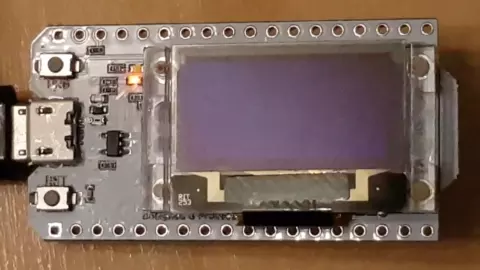

# ESP32-HelloWorld3D

A slightly more meaty "hello-world" test app for the ESP32 Heltec WiFi Kit 32.

Does the obligatory LED blinking but also draws an animated wireframe cube & FPS counter on the integrated SSD1306 OLED display.

Assumes https://platformio.org/platformio-ide & VSCode
